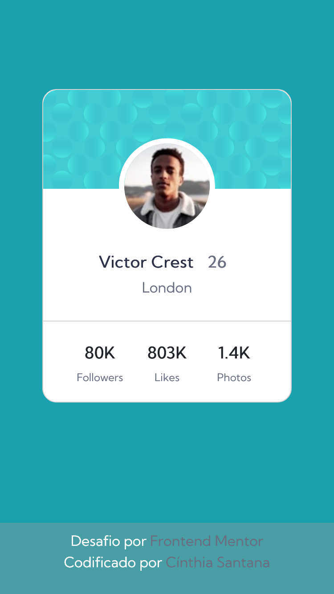
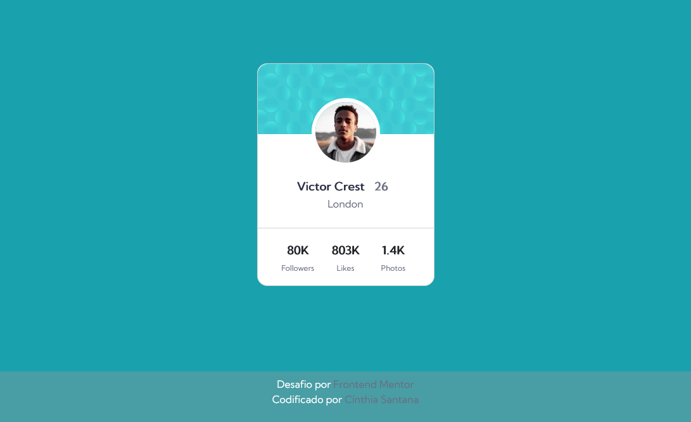

# Componente de cartão de perfil

Projeto simples e estático de cartão de perfil de um usuário

## Construído com

Marcação HTML5 semântica, propriedades personalizadas de CSS, fluxo de trabalho mobile-first e bootstrap.

## O que eu aprendi

Usei este projeto simple para treinar posicionamento com o bootstrap.

## Desenvolvimento contínuo

Pretendo tornar a aplicação mais dinâmica, com trocas de paginas e permitir a interação do usuário implementando entrada e saida de dados com JavaScript, para que seja criado um cartão de perfil real. Além de melhorar a responsividade.

# Resultado do projeto:

## Versão mobile

## Versão desktop

