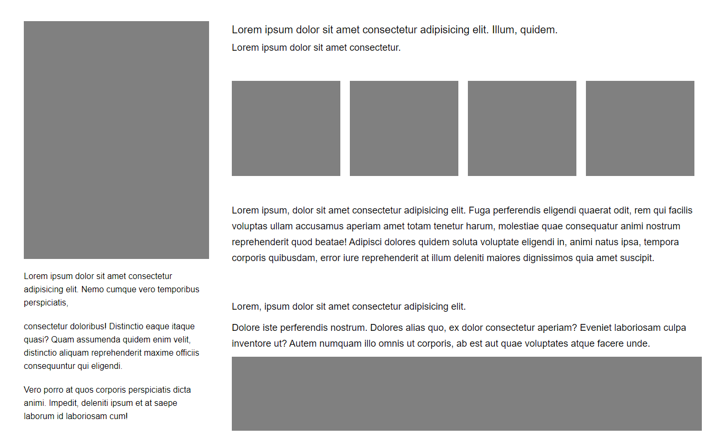
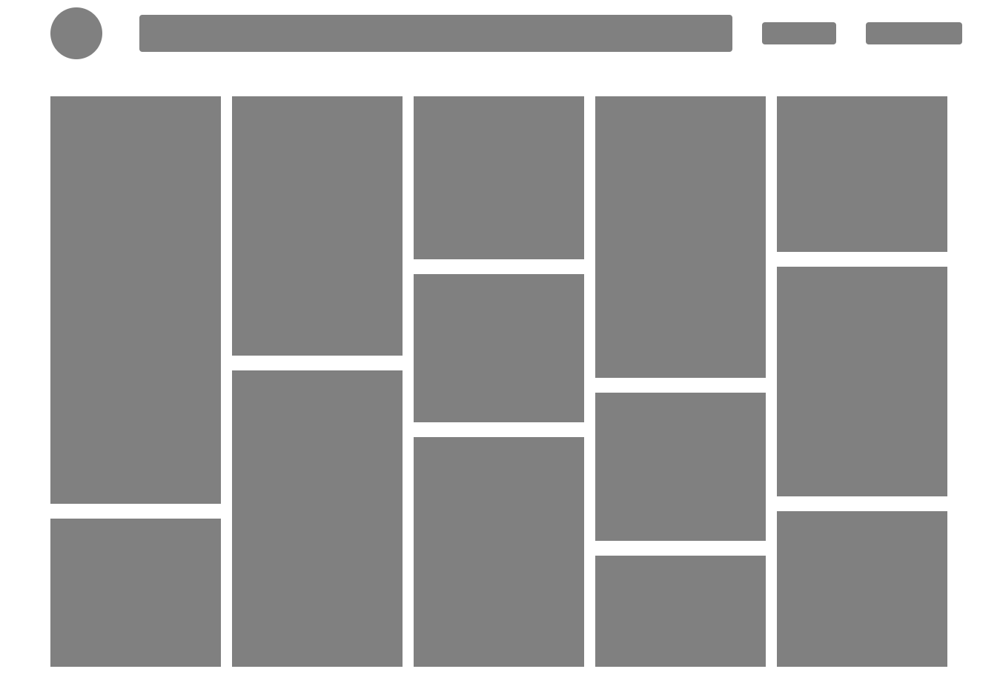
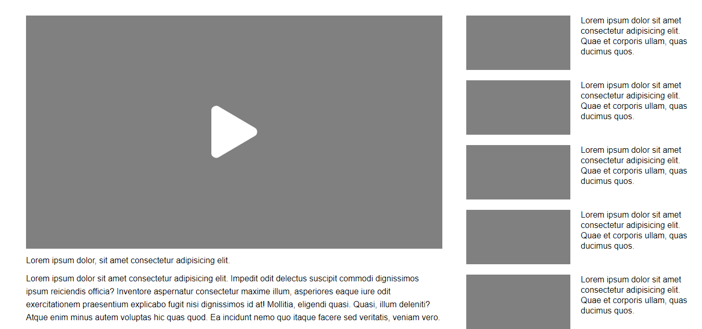
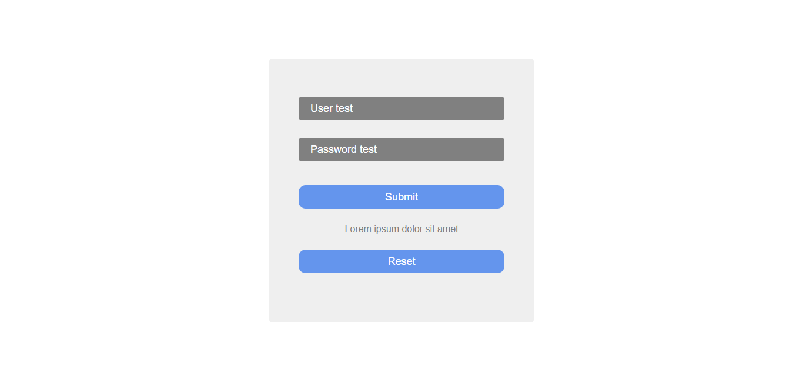
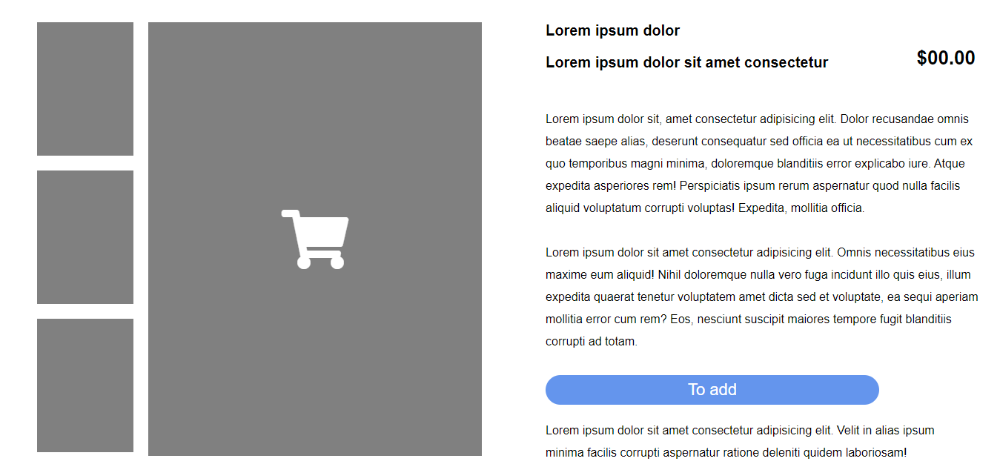
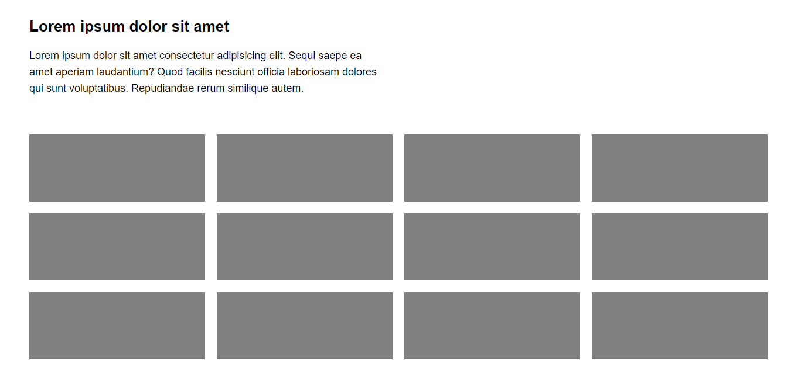
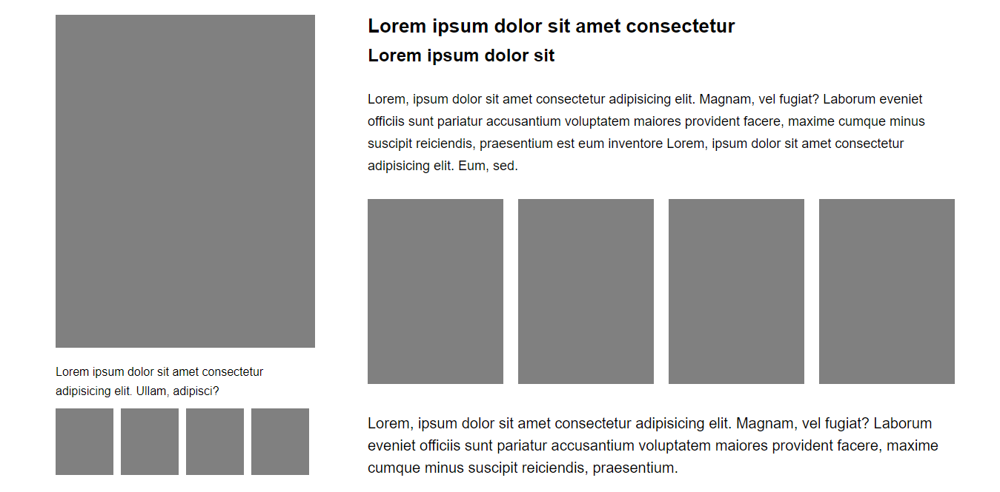
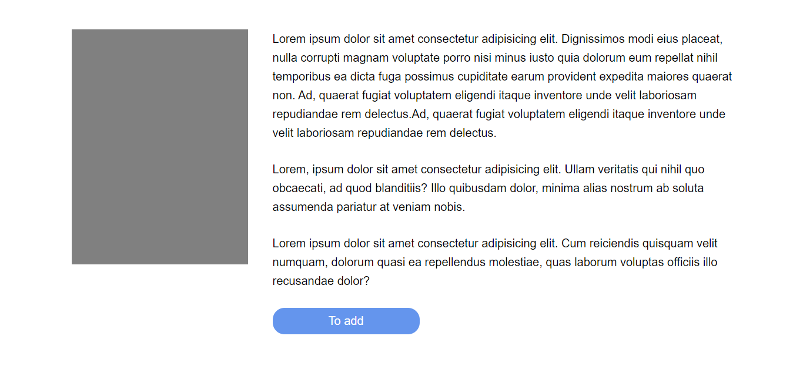

Layouts Teste

Essas páginas foram desenvolvidas apenas para exercitar o posicionamento de layouts com CSS puro.
São 9 páginas e cada uma representa um template diferente.

Confira os templates construídos abaixo:

1° Template

2° Template

3° Template

4° Template

5° Template

6° Template

7° Template

8° Template

9° Template

