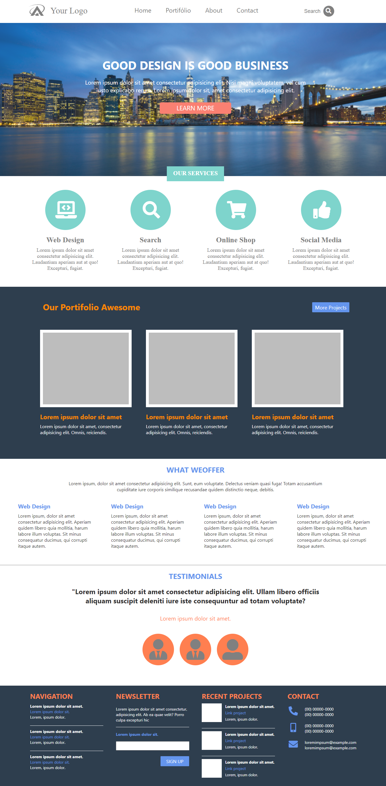
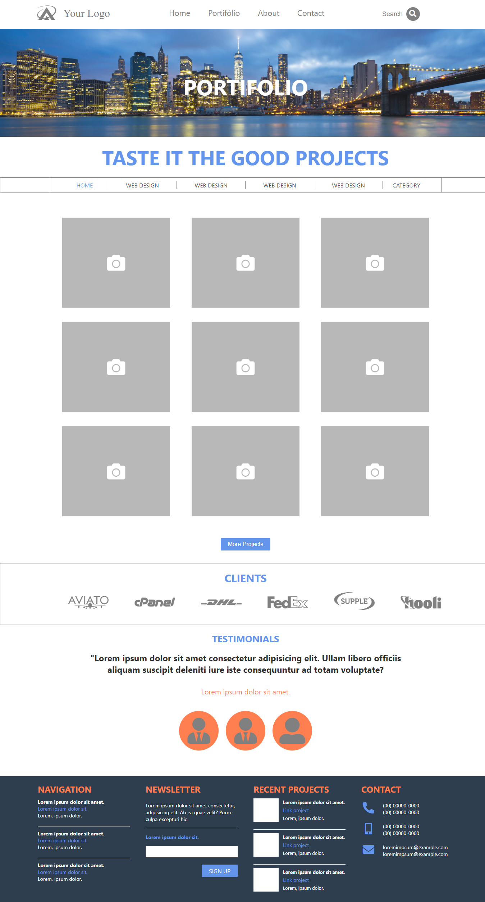
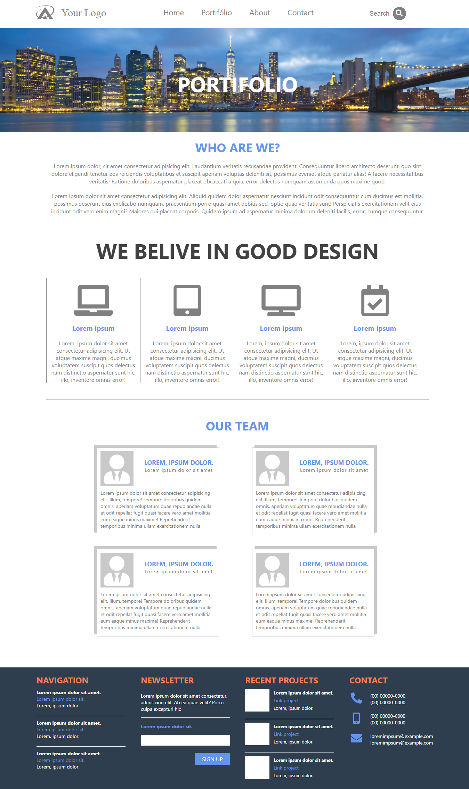
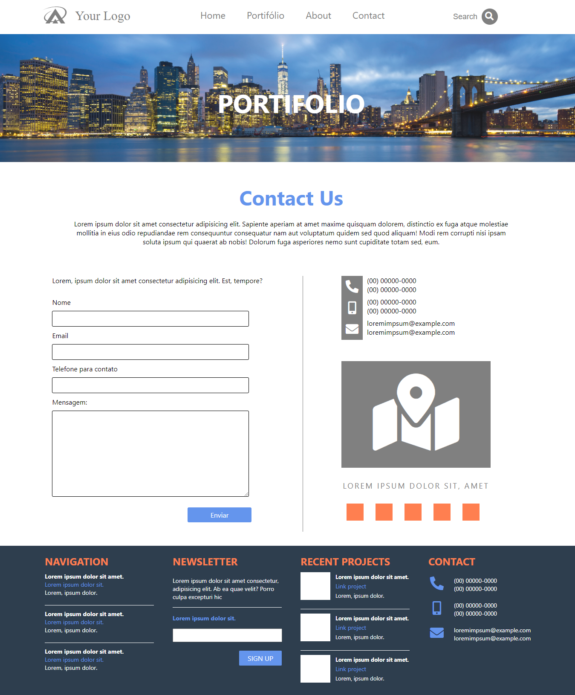

Site de exemplo de Portifolio

Este site foi construído apenas com HTML e CSS. Trabalhei com posicionamento dos layouts, formulários e icones para ilustrar.

Confira as páginas abaixo.

1° Página, apresentação geral:

2° Página, com apresentação dos projetos:

3° Página, com informações sobre o time e apresentação dos serviços:

4° Página, com informações para contato:

