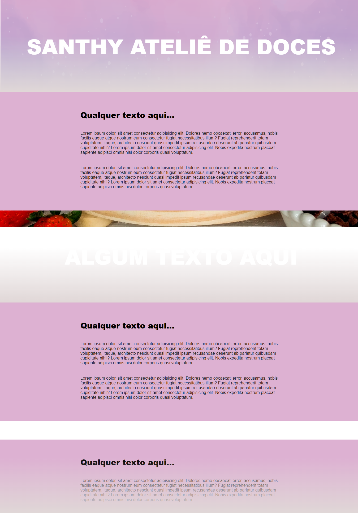

Site com efeito parallax

Este site foi construído apenas com HTML e CSS. Trabalhei com o efeito parallax, onde há um backgorund fixo em cada seção, e um efeito de sombreado na transição entre as seções.

Confira uma parte da página:

(o efeito parallax acontece apenas ao rolar a barra de rolagem no site)

