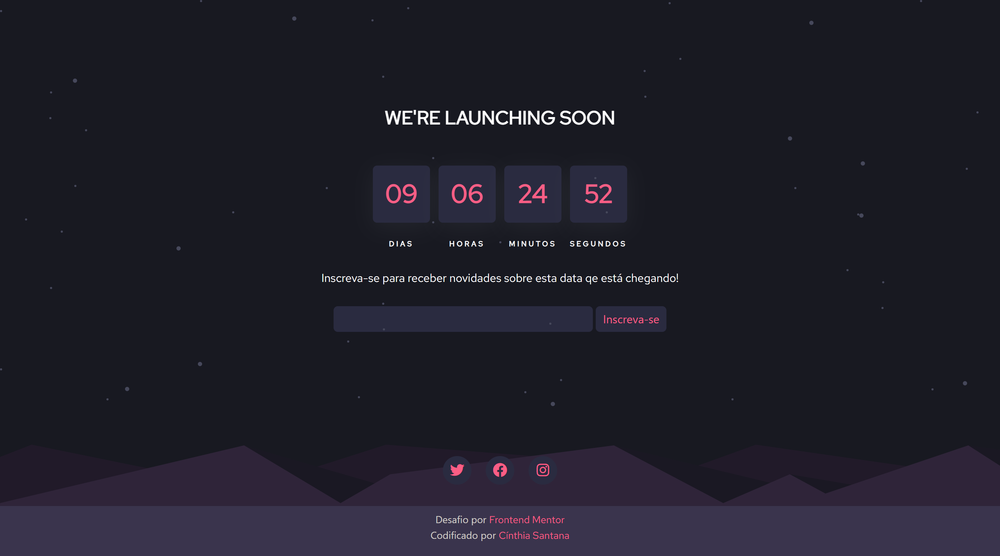

# Temporizador de contagem regressiva

Este é um temporizador que realiza uma contagem regressiva de dias a partir de uma data fixa definida.

# Meu processo

### Construído com

- Marcação HTML5 semântica
- CSS
- Fluxo de trabalho mobile-first
- JavaScript

# O que eu aprendi

Utilizei  fluxo de trabalho mobile-first, onde a aplicação encontra-se 100% responsiva. Trabalhei com JavaScript para tornar a contagem regressiva funcional.

Neste projeto aprendi mais sobre a semântica do html e como trabalhar com diferentes backgrounds, além de funções do JavaScript para manipular a hora.

# Desenvolvimento

Ainda existem otimizações para serem feitas no código posteriormente, pra que fique mais limpo, padronizado e com melhores soluções pra oque já está sendo executado. 

Também preciso trabalhar mais na experiência do usuário: botões, acessibilidade, menu de navegação, deixar a aplicação completamente funcional permitindo entrada de dados, e alterações como introdução do timer que deseja cronometrar, com mensagens personalizadas.

A baixo o resultado do projeto:

# Versão Mobile

# Versão Desktop

